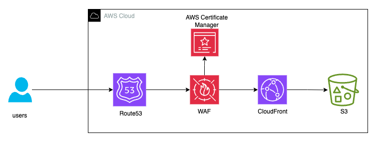

### Hosting a React Application on AWS with S3

### References

1. [How to deploy React App on AWS S3 - Amazon Route 53 - Amazon CloudFront](https://www.youtube.com/watch?v=-rCDLzTNcn8)

2. https://towardsaws.com/host-your-web-page-with-aws-s3-fa8b7d595292

3. https://docs.aws.amazon.com/prescriptive-guidance/latest/patterns/deploy-a-react-based-single-page-application-to-amazon-s3-and-cloudfront.html 