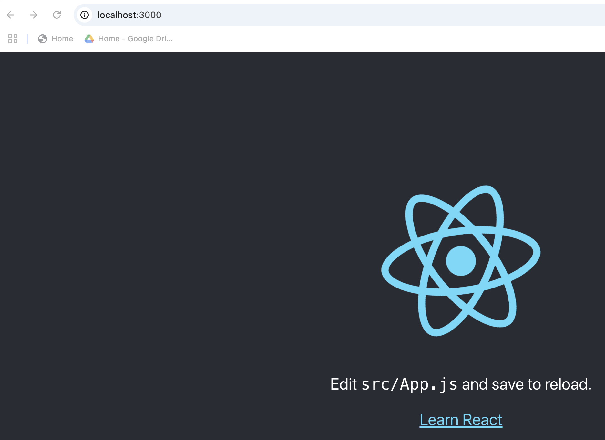
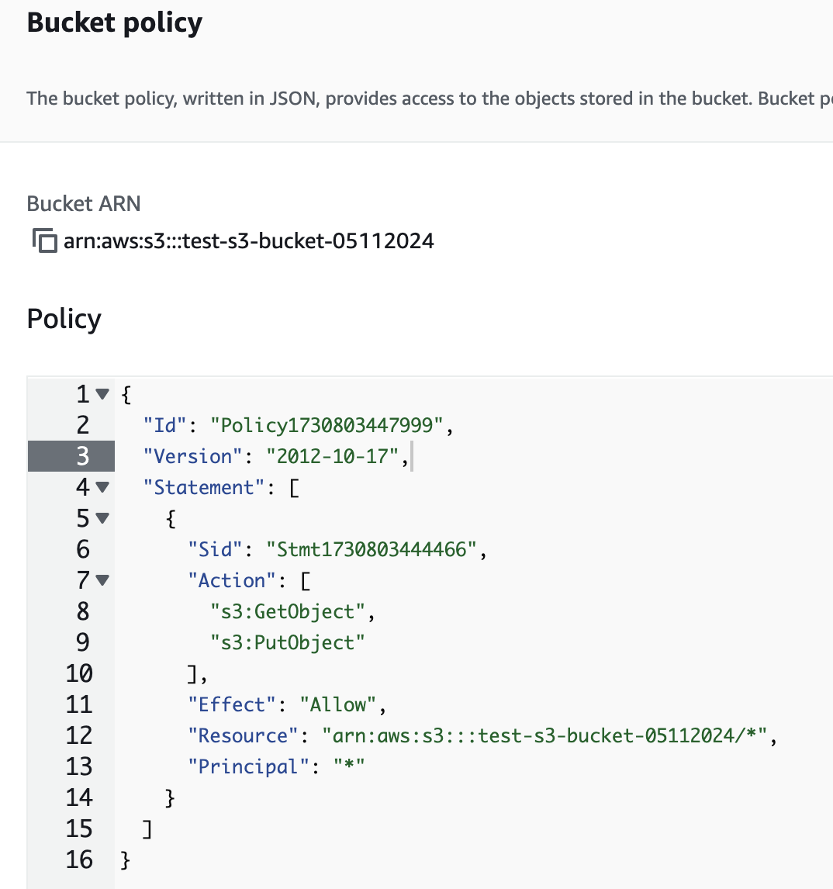
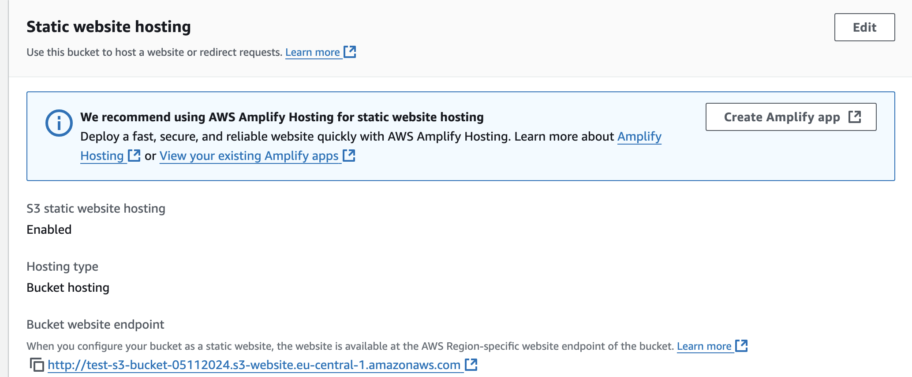

### Hosting a React Application on AWS with S3


- **Route53**: Manages domain registration and DNS routing for the application.
- **AWS Certificate Manager**: Provides an SSL/TLS certificate for secure HTTPS connections.
- **WAF (Web Application Firewall)**: Protects the application for most of Layer 7 security vulnerabilities. Such as the DDOS attack.
- **CloudFront**: Distributes content globally with caching for faster load times and lower latency.
- **S3**: Stores and hosts the React application.

### Create a simple React App

- ```npx create-react-app demo-react-s3```
- ```cd demo-react-s3```
- ```npm start```
   - 

- ```npm run build``` # Creates an optimized production build   

### Create a S3 Bucket

- Create a S3 Bucket (i.e named test-s3-bucket-05112024)

- Change the bucket policy
- 
```
{
  "Id": "Policy1730803447999",
  "Version": "2012-10-17",
  "Statement": [
    {
      "Sid": "Stmt1730803444466",
      "Action": [
        "s3:GetObject",
        "s3:PutObject"
      ],
      "Effect": "Allow",
      "Resource": "arn:aws:s3:::test-s3-bucket-05112024/*",
      "Principal": "*"
    }
  ]
}
```
   - 

- Enable Static Web site hosting on the S3 bucket
   - 
### References

1. [How to deploy React App on AWS S3 - Amazon Route 53 - Amazon CloudFront](https://www.youtube.com/watch?v=-rCDLzTNcn8)

2. https://towardsaws.com/host-your-web-page-with-aws-s3-fa8b7d595292

3. https://docs.aws.amazon.com/prescriptive-guidance/latest/patterns/deploy-a-react-based-single-page-application-to-amazon-s3-and-cloudfront.html 